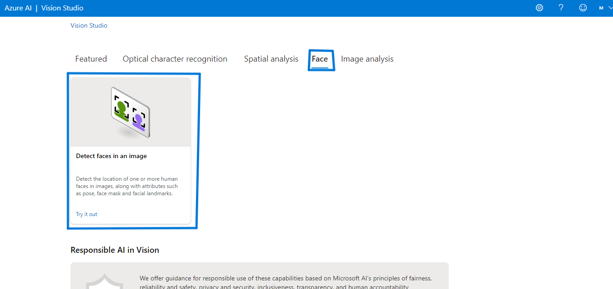
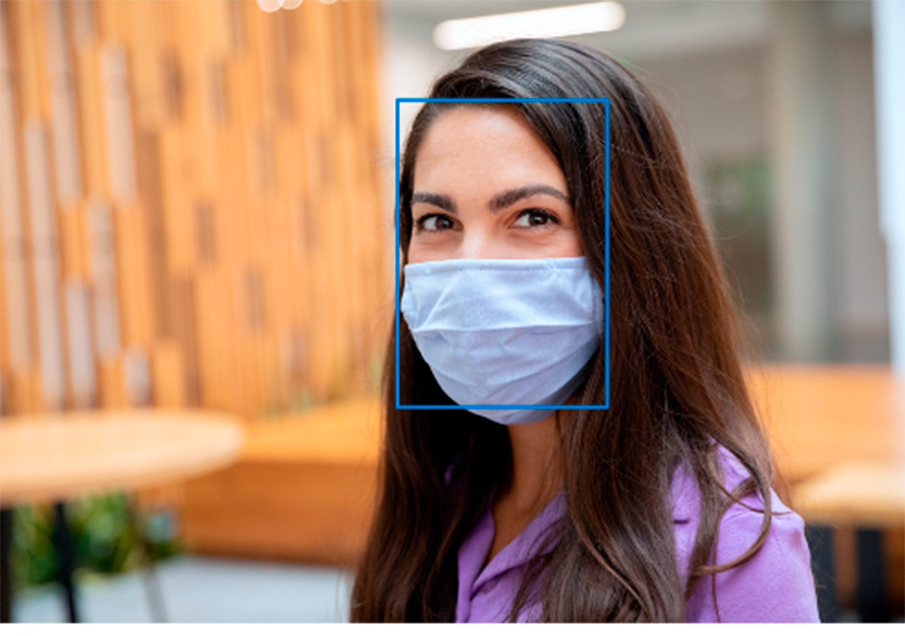
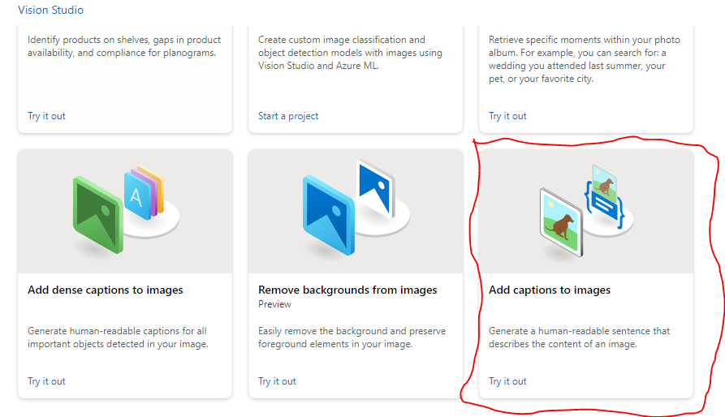
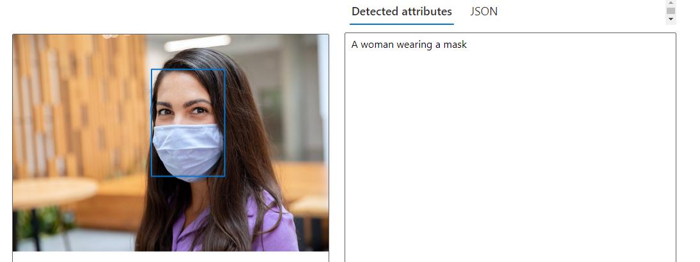

<h1>
      Utilizando o Vision Studio para identificar rostos 
</h1>

## Detect faces in an image
Através desse recurso, a IA identifica rostos contidos na imagem e os numera.

01 - Dentro do Vision Studio, na guia *face* clique na opção *Detect faces in an image*:
 

02 - O recurso trás algumas imagens de exemplo para que seja possível realizar testes do serviço e até mesmo a possibilidade de realizar upload de uma imagem de sua preferência, utilizei uma imagem do própio exemplo já disponíveis na aplicação. No meu caso, fiz o upload e minha face foi reconhecida:

 

No meu caso, fiz o upload e minha face foi reconhecida:
 

...

## Add captions to images
Com esse recurso, a IA adiciona descrição às imagens adicionadas.

01 - Dentro do Vision Studio, na guia *Image analysis* clique na opção *Add captions to images*:
 

02 - Você pode usar as imagens disponíveis para teste ou fazer upload da sua própria imagem. Utilizei a mesma imagem usada para fazer a detecção de faces, e a imagem foi descrita,:
 

## Conclusão de aprendizagem

A IA tem amuitos  recursos que podem trazer  facilidades para o nosso dia-a-dia e já está sendo realidade em muitos aspectos, principalmente com relação a segurança pública.