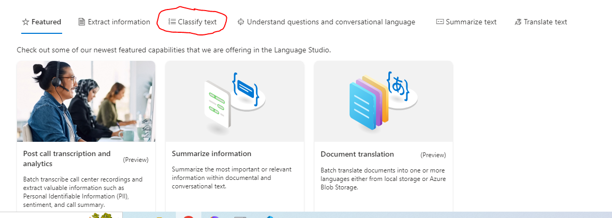
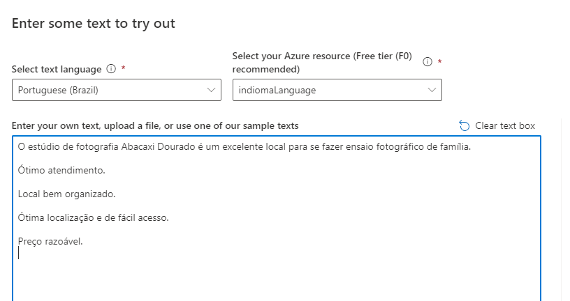
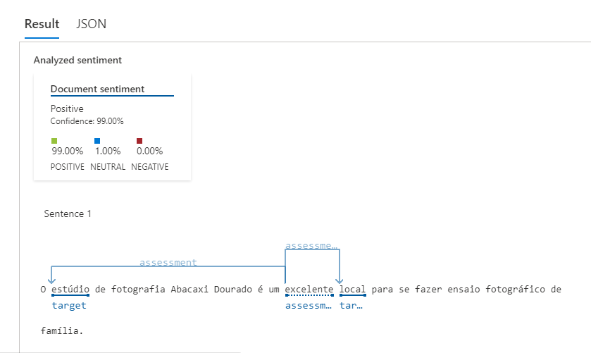

<h1>
     Análise de Sentimentos com o Language Studio
</h1>

## Analyse sentiment and mine opinions 
Esse recurso permite que  a IA lê o texto e retorna uma análise de sentimentos, sendo elas: negativa, neutra ou positiva.

01 - No Language Studio, na guia *Classify text* clique na opção *Analyse sentiment and mine opinions*:
 

02 - Em seguida, selecionamos a linguagem do texto que vamos adicionar , deixamos selecionados o *resource*, fazemos o upload do nosso arquivo .txt selecionamos a caixa e então apertamos no botão azul *Run*!
 

03 - Então, a IA faz a leitura do arquivo TXT e faz a análise, como podemos ver a seguir:
 

## Conclusão de aprendizagem
É uma ferramente que facilita  a análise de feedbacks recebidos, principalmente sabendo que não haverá a interação humana para realizar essa tarefa.

 