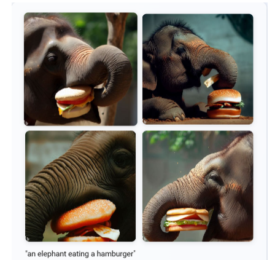

<h1>
     IA Generativa: Utilizando o Copilot e OpenAI
</h1>

## O que precisa ser feito?

O desafio propõe que sejam geradas imagens criadas pela IA Generativa utilizando  Microsoft Copilot.

[Microsoft Copilot](https://copilot.microsoft.com/?azure-portal=true)

## Primeira etapa: Acessando o Copilot 

01 - Entre no link disponibilizado acima e acesse o Microsoft Copilot

## Segunda etapa: Gerando as imagens

01 - Escreva o que você quer que seja criado (no meu caso, Create an image of an elephant eating a hamburger)

02 - Espere um pouco e então as imagens serão geradas como podemos ver abaixo:
 

## O que aprendi?  

As ferramentas de IA Generativa nos permite criar conteúdos, com apenas uma descrição do que desejamos que seja criado, isso com toda certeza é muito interessante, porém, devemos utilizar com responsabilidade e principalmente com muita ética.